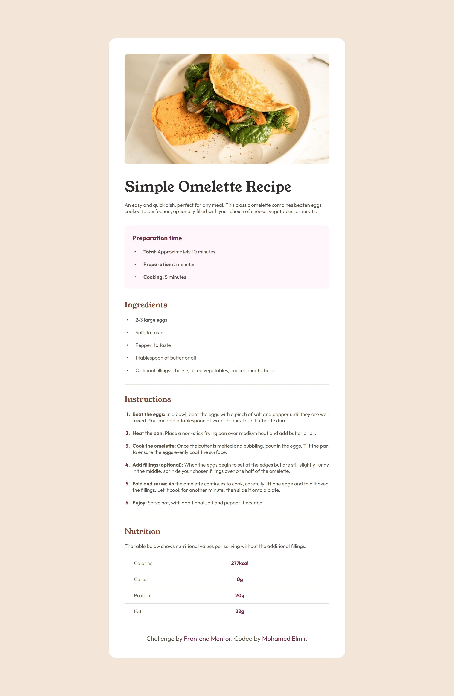

# Frontend Mentor - Recipe page solution

This is a solution to the [Recipe page challenge on Frontend Mentor](https://www.frontendmentor.io/challenges/recipe-page-KiTsR8QQKm). Frontend Mentor challenges help you improve your coding skills by building realistic projects. 

## Table of contents

- [Overview](#overview)
  - [Screenshot](#screenshot)
  - [Links](#links)
- [My process](#my-process)
  - [Built with](#built-with)
  - [What I learned](#what-i-learned)
  - [Continued development](#continued-development)
  - [Useful resources](#useful-resources)
- [Author](#author)

## Overview

### Screenshot



### Links

- Solution URL: [Add solution URL here](https://www.frontendmentor.io/solutions/css-counters-and-pseudoelements-SpoOTBxFHy)
- Live Site URL: [Add live site URL here](https://recipe-page-main11.netlify.app)

## My process

### Built with

- Semantic HTML5 markup
- CSS custom properties
- Flexbox
- VS CODE

### What I learned

I learned how to open a repository on github and play with it.
also learned how to make the color of the bullet list different than the text and added a favicon for the first time.
my understanding of the table element did improve.

```html
<link rel="icon" type="image/png" sizes="32x32" href="./favicon-32x32.png">
```
```css
ul li::before {
    content: "•";
    color: hsl(332, 51%, 32%);
    font-weight: bold;
    display: inline-block;
    width: 2em; 
    margin-left: -2em;
}

ol, ul {
    margin-left: -15px;
    list-style: none;
    counter-reset: li;
}

ol li::before {
    content: counter(li) ".";
    counter-increment: li; 
    color: hsl(332, 51%, 32%);
    display: inline-block;
    width: 2em;  
    margin-left: -2em;
    font-weight: bold;
}
```

### Continued development

I'm still not completely comfortable with some CSS techniques like grid display and I discovered some new properties like counter-increment and counter-reset.


### Useful resources

- [Example resource 1](https://stackoverflow.com/questions/13624276/how-to-separate-table-rows-with-a-line) - This helped me for the table border-gap problem. I really liked this border collapse trick and will use it going forward.
- [Example resource 2](https://www.w3.org/Style/Examples/007/color-bullets.en.html) - This is an amazing article which helped me finally understand how to make a list with the bullets a different color than the text. I'd recommend it to anyone still learning this concept.


## Author

- Frontend Mentor - [@elmirmed11](https://www.frontendmentor.io/profile/elmirmed11)

